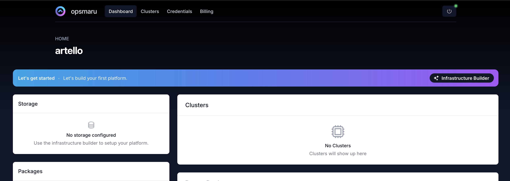
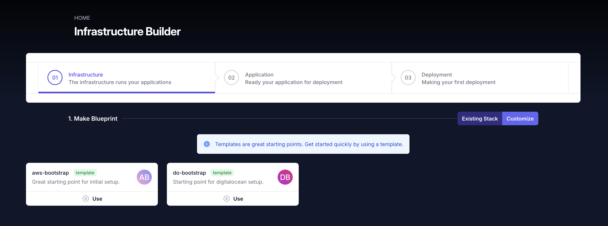
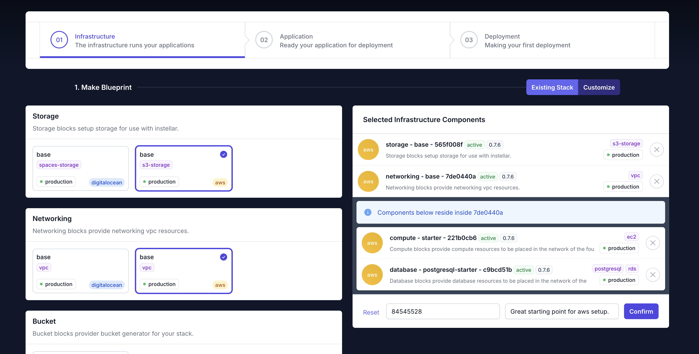
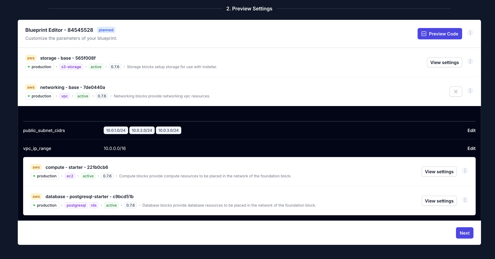
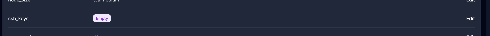
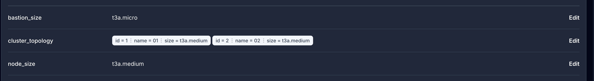
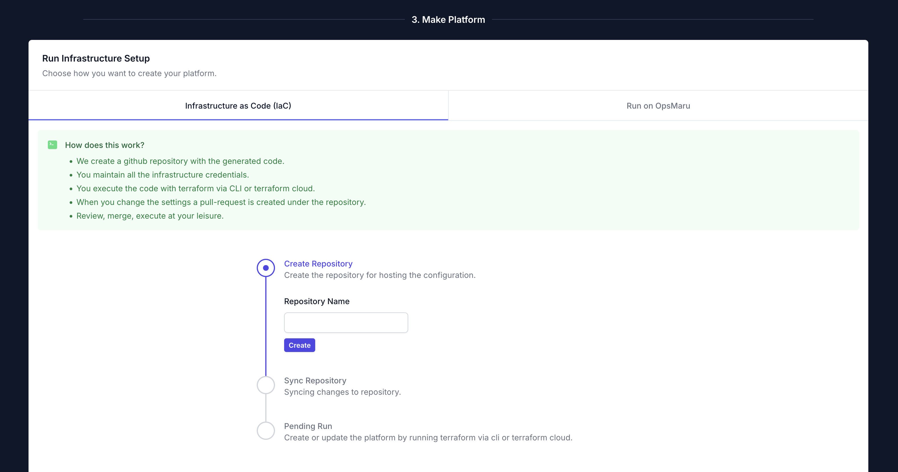

OpsMaru is a deployment platform creator. It helps developers set up platforms and also configures your applications for continuous deployment.

:::tip[Sign up for free!]
To get started, the first thing you'll need to do is [sign up](/auth/users/register) for an account.
:::

You'll be taken through the process and asked to connect your GitHub account.

## Initial Setup

Once you've reached the dashboard of your organization, click the `Infrastructure Builder`.

There are a few basic concepts to understand when using OpsMaru. You need to connect any platform you build to an account with a cloud provider (think AWS, DigitalOcean, Hetzner, and so on) – and you can even have several accounts with different providers and use them all with OpsMaru. 

Your OpsMaru platform will deploy your app/s to that account, and you'll be charged by that cloud provider for using their services. We don't re-sell cloud, instead, we make it easy for you to wire up your cloud platform and to change cloud providers whenever you want.

Let's start with the first cloud provider. This can be any vendor you choose. Currently we support two, and we'll be adding more to this list soon.

+ AWS
+ DigitalOcean

You can choose to bootstrap your account by selecting one of the templates in the Infrastructure Builder.

Click `Use` on one of the templates.

This will stage your first platform with all the components necessary to get you started.

+ Storage - this will configure storage for OpsMaru.
+ Network - this will set up your network, which will host the other components.
  + Compute - this will set up a cluster that will run your apps.
  + Database - this will create the database instance that your apps can use.

You can remove the database if you are running a front-end only app.

Once you're happy with your selection hit `Confirm` and hit `Next`. Remember, you can always come back to change the configuration later.

## Configure your platform

In the preview step you have the ability to tweak and finetune your platform configuration. By clicking `View Settings` on each layer, you'll see the finegrained control.

### SSH Keys

:::note[Importing your ssh key]
Make sure you import your ssh key into your cloud provider's dashboard before adding them here. The configuration will refererence the value in the dashboard.

+ [AWS](/docs/infrastructure/aws/ssh-keys)
+ [Digital Ocean](/docs/infrastructure/digitalocean/ssh-keys)

:::

If you wish to access your cluster via ssh you'll need to be sure to add your ssh key name to the compute block.

### Cluster Topology

:::note[Bastion node]
Bastion nodes are there to enable secure connectivity. They're a security feature of your cluster, and they cannot be removed. We're using the cheapest node, so they don't add much to the cost.

If you would like to learn more about bastion nodes [click here](https://en.wikipedia.org/wiki/Bastion_host).
:::

The default configuration will set up a 3 node cluster + 1 bastion. You can change the instance type based on your requirements. More power, more ram,  more expensive. You can edit the `cluster_topology` and remove the default nodes and come back to add them later when you need more scaling.

You can also use the `Preview Code` to see the generated code. If you're happy with everything click next to continue.

## Run your Configuration

You'll be brought to the run step. This is where you'll be able to choose a name for your repository. OpsMaru will then create a repository in your GitHub organization with all the configuration files.

:::tip[Terraform / OpenTOFU!]
OpsMaru outputs standard Terraform / OpenTofu-based configuration. You can run this configuration locally in your terminal or use a cloud based service.

We recommend using a cloud based service. The integration between cloud-based services like Terraform Cloud and GitHub makes the experience much better.
:::

The video below shows you how to connect your repository to Terraform Cloud, and also how you can manage your cloud provider credentials.

<iframe src="https://www.loom.com/embed/079bdd740b65437f88b3331edbfb4b6f?sid=ffff90cc-1313-42a9-b075-5dc642f7686f" frameborder="0" webkitallowfullscreen mozallowfullscreen allowfullscreen style="position: absolute; top: 0; left: 0; width: 100%; height: 100%;"></iframe>

