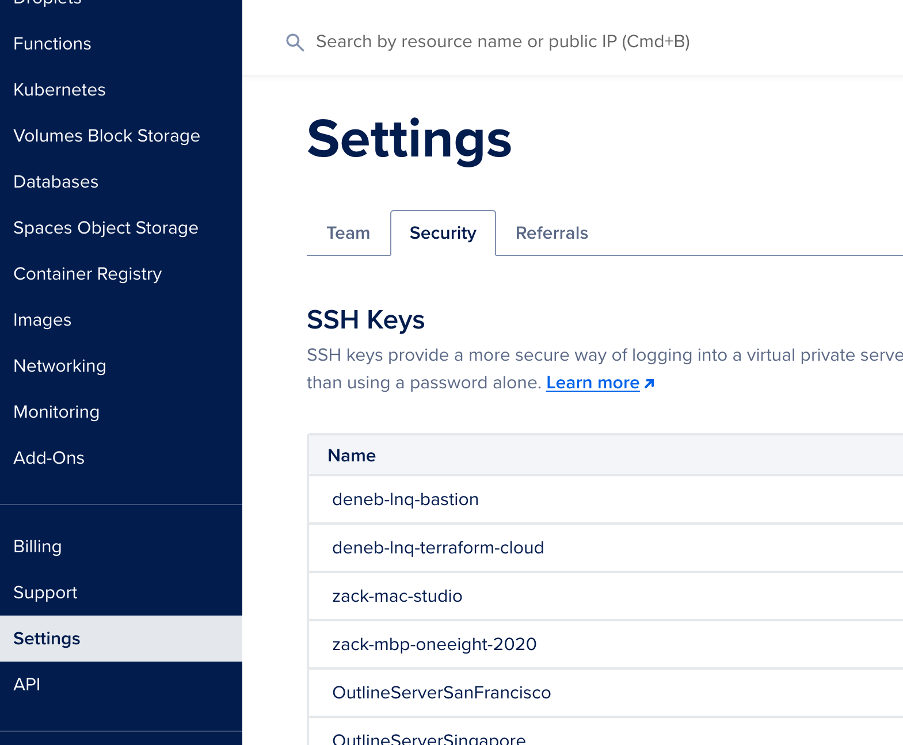
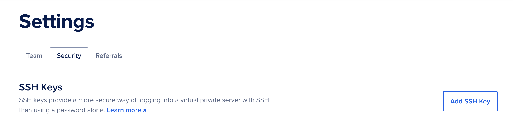
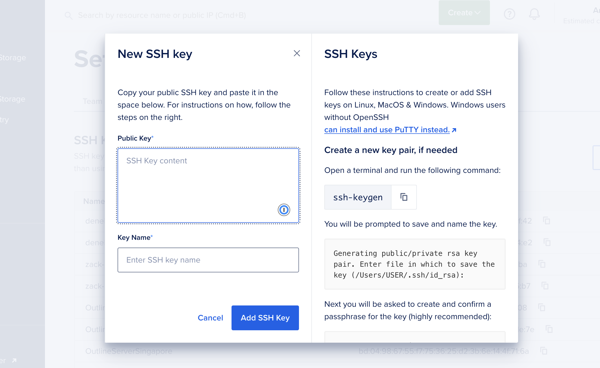
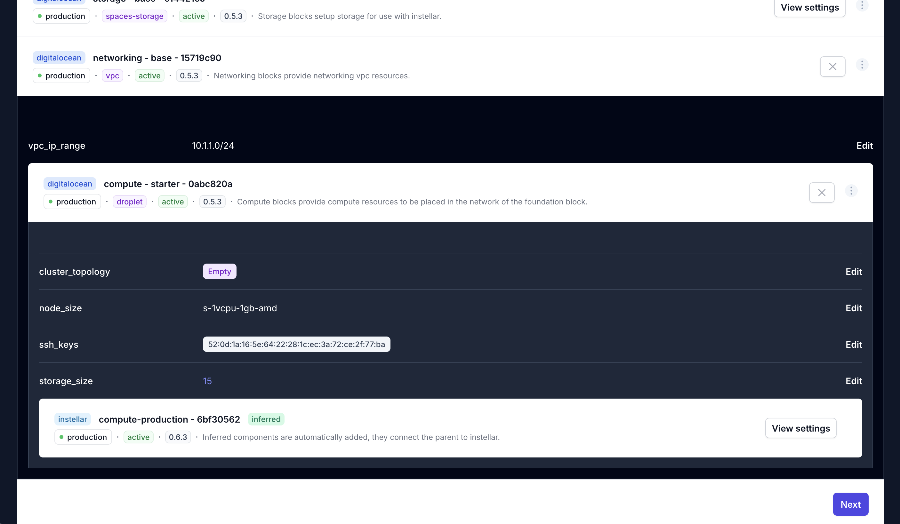

This guide shows you how to import your ssh key into your DigitalOcean account.

Let's begin by going to the `Settings` page of your digitalocean console. Once on the settings page, look at the sidebar and you'll see the `Security` section.



Click on the `Add SSH key` button.



## Create SSH Key

You'll see an `Add SSH key` form. Copy the ssh key from your terminal into the `Public Key` field.



You can get the public key contents from your terminal by running

```bash
cat ~/.ssh/id_rsa.pub
```

If you are using ed25519 keys, you can run

```bash
cat ~/.ssh/id_ed25519.pub
```

Give the key a name and click `Add SSH key`.

## Referencing SSH Key

:::tip[Referencing ssh key]
With DigitalOcean, you will need to use the fingerprint in the infrastructure builder.
:::

In your DigitalOcean ssh keys listing, you will see the fingerprint.


When you want to reference a given ssh key you will need to copy the fingerprint to add it into your blueprint.


